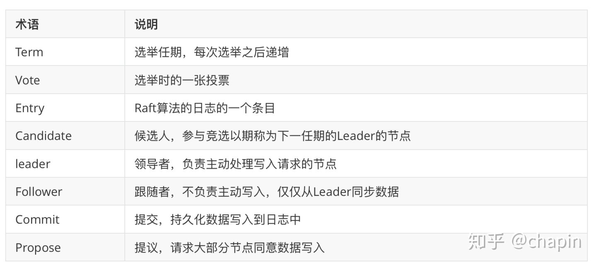

## etcd

etcd 是一个分布式、可靠 key-value 存储的分布式系统。当然，它不仅仅用于存储，还提供共享配置及服务发现。

### etcd 应用场景
- 配置管理
- 服务注册发现
- 选主
- 应用调度
- 分布式队列
- 分布式锁

### etcd 工作原理

#### 1.4.1 如何保证一致性

etcd 使用 raft 协议来维护集群内各个节点状态的一致性。简单说，etcd 集群是一个分布式系统，由多个节点相互通信构成整体对外服务，每个节点
都存储了完整的数据，并且通过 Raft 协议保证每个节点维护的数据是一致的。

每个etcd节点都维护了一个状态机，并且，任意时刻至多存在一个有效的主节点。主节点处理所有来自客户端写操作，通过Raft协议保证写操作对状态机
的改动会可靠的同步到其他节点。

#### 1.4.2 数据模型

etcd 的设计目标是用来存放非频繁更新的数据，提供可靠的 Watch插件，它暴露了键值对的历史版本，以支持低成本的快照、监控历史事件。这些设计
目标要求它使用一个持久化的、多版本的、支持并发的数据数据模型。

当 etcd 键值对的新版本保存后，先前的版本依然存在。从效果上来说，键值对是不可变的，etcd 不会对其进行 in-place 的更新操作，而总是生成
一个新的数据结构。为了防止历史版本无限增加，etcd 的存储支持压缩（Compact）以及删除老旧版本。

**逻辑视图**

从逻辑角度看，etcd 的存储是一个扁平的二进制键空间，键空间有一个针对键（字节字符串）的词典序索引，因此范围查询的成本较低。

键空间维护了多个修订版本（Revisions），每一个原子变动操作（一个事务可由多个子操作组成）都会产生一个新的修订版本。在集群的整个生命周期
中，修订版都是单调递增的。修订版同样支持索引，因此基于修订版的范围扫描也是高效的。压缩操作需要指定一个修订版本号，小于它的修订版会被移除。

一个键的一次生命周期（从创建到删除）叫做 “代 (Generation)”，每个键可以有多个代。创建一个键时会增加键的版本（version），如果在当前
修订版中键不存在则版本设置为1。删除一个键会创建一个墓碑（Tombstone），将版本设置为0，结束当前代。每次对键的值进行修改都会增加其版本
号 — 在同一代中版本号是单调递增的。

当压缩时，任何在压缩修订版之前结束的代，都会被移除。值在修订版之前的修改记录（仅仅保留最后一个）都会被移除。

**物理视图**

etcd将数据存放在一个持久化的B+树中，处于效率的考虑，每个修订版仅仅存储相对前一个修订版的数据状态变化（Delta）。单个修订版中可能包含了
B+树中的多个键。

键值对的键，是三元组（major，sub，type）：

- major：存储键值的修订版
- sub：用于区分相同修订版中的不同键
- type：用于特殊值的可选后缀，例如 t 表示值包含墓碑

键值对的值，包含从上一个修订版的 Delta。B+ 树 —— 键的词法字节序排列，基于修订版的范围扫描速度快，可以方便的从一个修改版到另外一个的
值变更情况查找。

etcd同时在内存中维护了一个B树索引，用于加速针对键的范围扫描。索引的键是物理存储的键面向用户的映射，索引的值则是指向B+树修该点的指针。

#### 1.5 etcd 读写性能

按照官网给出的数据，在2CPU，1.8G内存，SSD磁盘这样的配置下，单节点的写性能可以达到16KQPS, 而先写后读也能达到12K QPS。

#### 1.6 etcd 术语



### 二、安装和运行

```shell script
# 检查安装
./etcd --version
./etcdctl version

# 启动etcd，通过IP访问方式
./etcd --listen-client-urls http://0.0.0.0:2379 --advertise-client-urls http://0.0.0.0:2379 --listen-peer-urls http://0.0.0.0:2381

# write,read to etcd
./etcdctl --endpoints=127.0.0.1:2379 put name dazuo
```

### 三、与etcd交互

etcd提供了`etcdctl`命令行工具和`HTTP API`两种交互方法。`etcdctl`命令行工具用go语言编写，也是对`HTTP API`的封装。

- **put**：将 key 和 value 存储到 etcd 集群中。每个存储的密钥都通过 Raft 协议复制到所有 etcd 集群成员，以实现一致性和可靠性。
- **get**：应用程序可以从一个 etcd 集群中读取 key 的值。
- **del**：应用程序可以从一个 etcd 集群中删除一个 key 或一系列 key。
- **watch**：应用程序可以使用watch观察一个键或一系列键来监视任何更新。
- **lock**：分布式锁，一个人操作的时候，另外一个人只能看，不能操作
- **txn**：从标准输入中读取多个请求，将它们看做一个原子性的事务执行。事务是由条件列表，条件判断成功时的执行列表（条件列表中全部条件为真表示成功）和条件判断失败时的执行列表（条件列表中有一个为假即为失败）组成的。
- **compact**：压缩过去的修订版本。压缩后，etcd删除历史版本，释放资源供将来使用
- **lease**：etcd 也能为 key 设置超时时间，但与 redis 不同，etcd需要先创建 lease，然后 put 命令加上参数 –lease= 来设置。

> 常用命令

```shell script
# CURD
./etcdctl --endpoints=127.0.0.1:2379 put name dazuo
# watch
./etcdctl --endpoints=127.0.0.1:2379 watch name
# 分布式锁
./etcdctl --endpoints=127.0.0.1:2379 lock mutex1
# 创建lease
./etcdctl --endpoints=127.0.0.1:2379 lease grant 30
# 授予租约
./etcdctl --endpoints=127.0.0.1:2379 put name dazuo --lease=694d6ee9ac06946a
# 撤销租约
./etcdctl --endpoints=127.0.0.1:2379 lease revoke 694d7277d9417b48
# 查看租赁信息
./etcdctl --endpoints=127.0.0.1:2379 lease timetolive 694d7277d9417b48
# 获取哪些 key 使用了租赁信息
./etcdctl --endpoints=127.0.0.1:2379 lease timetolive --keys 694d6ee9ac06946a
# 保持租约有效（持续刷新其TTL来保持租约不会过期）
./etcdctl --endpoints=127.0.0.1:2379 lease keep-alive 32695410dcc0ca06
```
